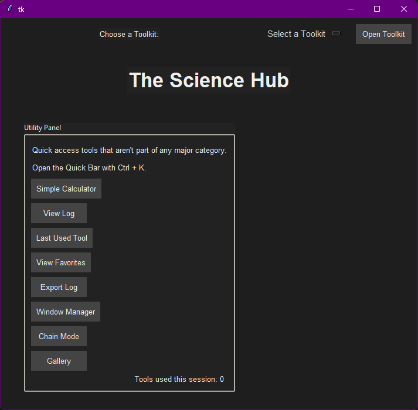
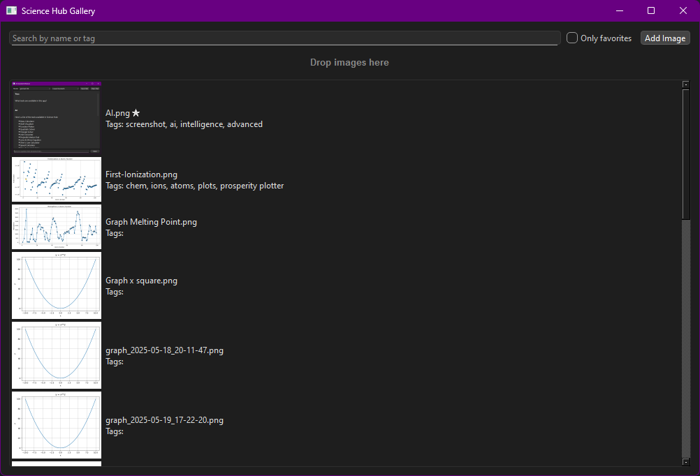
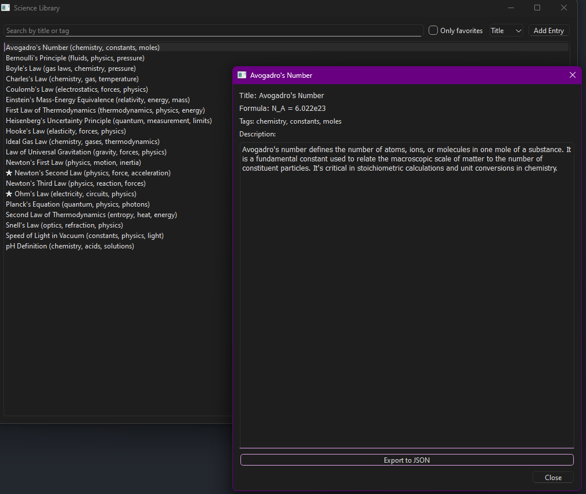

# The Science Hub

A versatile, cross-discipline tool for learning, experimenting, and doing science with Python.

    

---

## What is The Science Hub?

**The Science Hub** is a modular, self-built desktop application designed to collect, organize, and extend a set of scientific tools under one easy interface.  
It began as a personal learning project in Python and has grown into a flexible platform for chemistry, biology, math, physics, and more.  
Whether you want to calculate, visualize, or simply manage your results and formulas, The Science Hub is for you.

---

## Features

- **Science Library**  
  Organize, search, and filter your own formulas, scientific concepts, notes, and references. Attach images to entries and link them to experiment results.

- **Gallery**  
  Asset manager for all scientific images (plots, diagrams, experiment photos). Features drag-and-drop import, tagging, filtering, renaming, and favorites.

- **Tool Launcher**  
  Instantly access a growing suite of calculators and utilities: chemistry (e.g., molar mass, molecular visualizer), math (Pythagoras, unit converter), physics, biology, geology, and more.

- **Result Storage**  
  Store generated plots and outputs for easy reference and retrieval. Connect gallery images to library entries and vice versa.

- **Batch Import/Export**  
  Import or export multiple entries and images for backup, sharing, or migration.

- **Customizable and Extensible**  
  Built to be modular. Add new tools as Python scripts with minimal setup.

---

## Quick Start

### Prerequisites

- Python 3.8+
- [Pillow](https://pypi.org/project/Pillow/)
- [tkinterDnD2](https://pypi.org/project/tkinterDnD2/)
- [rdkit](https://www.rdkit.org/) (optional, for chemistry tools)
- See `requirements.txt` for a complete list if present

Install dependencies with:

```sh
pip install Pillow tkinterdnd2
# (and optionally)
pip install rdkit
````

### Installation

Clone the repository:

```sh
git clone https://github.com/PabloOeffnerFerreira/The-Science-Hub.git
cd The-Science-Hub
```

(Optional) Set up a virtual environment:

```sh
python -m venv venv
source venv/bin/activate  # or venv\Scripts\activate on Windows
pip install -r requirements.txt  # if present
```

### Running The Science Hub

```sh
python hub.py
```

This launches the main window, from which all tools and features are accessible.

---

## Tutorial: Using The Science Hub

### The Main Window & Tool Launcher

* **Opening Tools:**
  Use the side or top panel to launch calculators, visualizers, and converters. You can pin your favorites for quick access.
  Tools range from chemistry helpers to general math, biology, and geology.

* **Chain Mode:**
  If you want to combine outputs from multiple tools, activate Chain Mode for multi-step calculations.

### Science Library

* **Add/Edit Entries:**

  * Click “Add Entry” to start a new record.
  * Fill in a title, formula, tags, description, and (optionally) attach an image.
  * For the image, click "Pick from Gallery" to visually select from all imported images, or type the relative filename.
  * Tags are comma-separated for easy filtering later.

* **Searching and Filtering:**
  Use the search bar and tag field to quickly narrow down to the entry you need.

* **Recent and Favorite Entries:**
  Mark important entries as Favorites, and view recently accessed items for faster workflow.

* **Exporting/Importing:**
  Use the buttons at the top to backup your entries or migrate them to another system.

### Gallery

* **Importing Images:**

  * **Drag and Drop:** Drag any supported image file into the Gallery window.
  * **Import Image Button:** Use the button to select files from disk.
  * Images are copied into your `/images` folder for use everywhere in the hub.

* **Organizing:**

  * Rename images, add tags, favorite/unfavorite, or delete as needed.
  * Filter images by tag, favorite status, or filename.

* **Connecting to Library:**

  * When editing a Library entry, use the Gallery picker to choose the right image for documentation or visual reference.
  * Images from both `/images` and `/results` folders are accessible.

### Results

* Tools that generate plots or images (like chemistry visualizers or data charts) store their outputs in `/results`.
* These images automatically appear in the Gallery and can be attached to Science Library entries.

### Batch Operations

* **Import/Export:**
  Backup or transfer your whole Library as a JSON file.
  This is useful for sharing with collaborators or just keeping your data safe.

---

## Extending The Science Hub

Want to add a new tool?

1. Create a new Python script for your tool (e.g., `myphysics_tool.py`).
2. Register it in the tool launcher or utility panel in `hub.py`.
3. Each tool can use the window management and theme system provided.
4. Store outputs to the results or images folder for seamless Gallery integration.

---

## Screenshots

* 
* 
* 

---

## Contributing

Pull requests are welcome! If you have a feature idea, bug report, or new tool to contribute:

1. Fork this repository
2. Create a new branch (`git checkout -b feature-YourFeature`)
3. Commit your changes
4. Push to your branch
5. Open a pull request

**Feel free to file issues or suggestions if you’re not ready to code.**

---

## License

This project is licensed under the MIT License.
See [LICENSE](LICENSE) for details.

---

## Support & Feedback

If you run into bugs, want to request a feature, or need help using The Science Hub, open an issue on [GitHub](https://github.com/PabloOeffnerFerreira/The-Science-Hub/issues).

---

*Enjoy exploring, calculating, and organizing with The Science Hub!*
