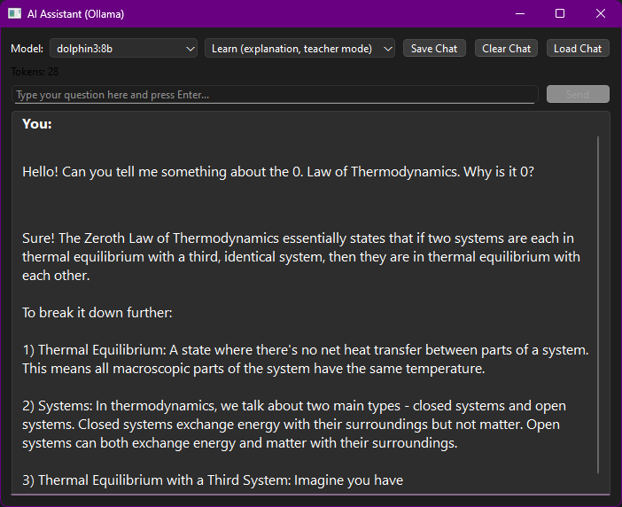

# The Science Hub

A modular, cross-discipline platform for learning, experimenting, and doing science with Python—now with a context-aware, locally running AI assistant and full system integration.


---

## What is The Science Hub?

**The Science Hub** is a self-built desktop application that combines science tools, image management, data organization, and offline AI into one cohesive system.  
Originally developed by Pablo Oeffner Ferreira at age 14, it has grown into a serious toolset spanning chemistry, physics, biology, geology, math—and now, intelligent local reasoning.

From launching simulations to asking scientific questions, **Science Hub adapts to your system and your curiosity**.

---

## Features

- **Science Library:**  
  Organize, search, and filter your own formulas, concepts, and references. Link entries to experiments or generated plots.

- **Gallery:**  
  Drag-and-drop interface for managing scientific diagrams and results. Supports tagging, favoriting, and linking to entries.

- **Tool Launcher:**  
  Instant access to modular calculators and visualizers for chemistry, physics, biology, geology, and math. Tools are lightweight and extendable.

- **Result Storage:**  
  Store generated plots and outputs in a structured way, and connect them to concepts in the Science Library.

- **Batch Import/Export:**  
  Migrate entries, back up experiments, or share entire sessions.

- **Integrated AI Assistant (Offline):**  
  Powered by [Ollama](https://ollama.com/), the assistant runs 100% locally. No accounts, no APIs, and no cloud. Just tools and thinking—on your machine.

---

## AI Assistant – Now Fully Integrated

### Modes and Capabilities

- **Learn Mode** – Step-by-step explanations for science questions or math breakdowns.
- **Use Mode** – Fast facts, direct answers, no fluff.
- **Casual Mode** – Friendly chat with tool awareness and clean formatting.

The assistant now understands **your tools**, **your project structure**, and **when to help**. It will only recommend Science Hub tools *when appropriate*. It never advertises or explains itself unless you ask.

---

### Launcher Integration: The Holy Ultramoly Gigasoley – TOOL RUNNER™

All AI models are now accessible via the global quick-launch bar:

- Type `tiny`, `gem4`, `phi4r use`, or `dolphin learn` to launch the assistant with a specific model and mode.
- Every supported model has a shortcut name.
- AI opens in a subprocess with its own window, so Science Hub stays stable.

---

### Chat Features

- **Load Chat** – Resume previous conversations and continue reasoning mid-session.
- **Token Counter** – Live tracking of prompt size. Colored warnings let you know when to switch models.
- **Model Switcher** – Change models mid-conversation without losing history.
- **Tooltip Descriptions** – Hover over models to learn what they do best and what hardware they need.

---

### Model Awareness and Specialization

All 16 Ollama models supported:
- From **ultra-fast** (`tinyllama:1.1b`) to **deep logical analyzers** (`phi4-reasoning:14b`)
- Includes **code assistants**, **math solvers**, **multi-turn chat models**, and **low-resource tools**
- Fully local—no external data use

---

### How to Enable the AI Assistant

1. **Install Ollama:**  
   [Download Ollama](https://ollama.com/download) for your OS

2. **Pull a model:**  
   For example:
   ```sh
   ollama pull dolphin3:8b
   ollama pull tinyllama:1.1b

3. **Run Science Hub as usual**, and launch the AI assistant from:

   * The **AI button**
   * The **global quick launcher**
   * Or directly by typing a model name

---

### Minimum Specs

* **Minimum:**
  8 GB RAM, 4 GB VRAM — use `tinyllama`, `phi4-mini`, or `gemma3:2b`
* **Recommended:**
  16 GB RAM, 8+ GB VRAM — for full functionality with `dolphin3`, `qwen3`, `mathstral`, or `phi4`

---

## Quick Start

1. **Clone the repository:**

```sh
git clone https://github.com/PabloOeffnerFerreira/The-Science-Hub.git
cd The-Science-Hub
```

2. **(Optional) Create a virtual environment:**

```sh
python -m venv venv
source venv/bin/activate  # or venv\Scripts\activate on Windows
pip install -r requirements.txt
```

3. **Install dependencies:**

```sh
pip install Pillow tkinterdnd2
# and optionally: conda install -c conda-forge rdkit
```

4. **Run the app:**

```sh
python hub.py
```

---

## Toolkits & Modules

* **Chemistry:** Molar mass, molecular visualization, isotopes
* **Physics:** Kinematics, forces, motion, optics
* **Biology:** DNA tools, codon lookup, transcription
* **Geology:** Mineral explorer, plate motion calculators
* **Math:** Function plotting, equation solvers, unit conversion

All tools are **modular Python scripts** and integrate with the gallery, AI, and storage.

---

## Screenshots




---

## License

MIT License. See [LICENSE](LICENSE) for full terms.

---

## Support & Contributions

Suggestions and bug reports are welcome at
[GitHub Issues](https://github.com/PabloOeffnerFerreira/The-Science-Hub/issues)

---

*Science Hub is not a chatbot. It is a science system that includes one.*
