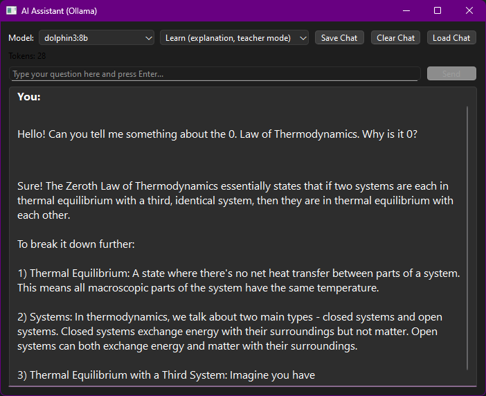
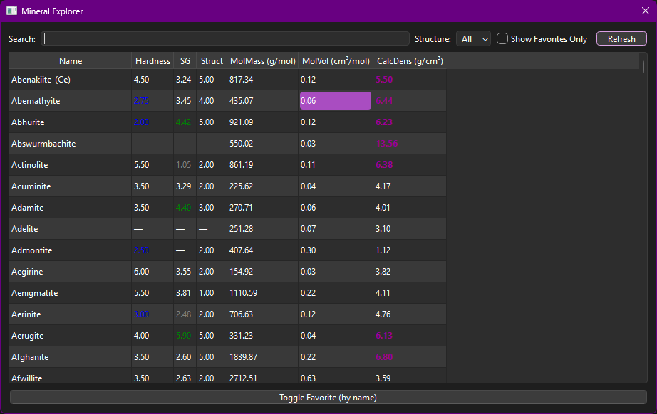
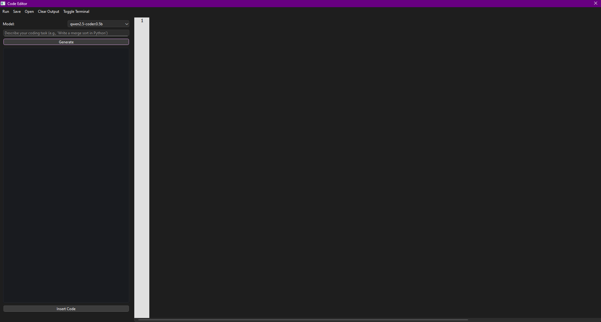

# The Science Hub

---

## O que é o Science Hub?

O **Science Hub** é uma plataforma modular e offline para ciência, feita para quem quer aprender, experimentar, pesquisar, visualizar e organizar conceitos científicos no computador, com ferramentas próprias, inteligência artificial local e integração completa de dados.

Você pode simular fenômenos, resolver problemas de física, química, biologia, geologia e matemática, salvar resultados, organizar fórmulas, gerenciar imagens científicas e buscar artigos — tudo em um único sistema, feito para explorar ciência do seu jeito.

---

## Principais Funcionalidades

- **Biblioteca Científica:** Cadastre, busque e filtre fórmulas, conceitos, descrições, imagens e tags. Perfeito para criar sua enciclopédia científica pessoal, com exportação/importação em lote.
- **Galeria de Resultados:** Gerencie, visualize e organize imagens, gráficos, experimentos e resultados, tudo com favoritos, tags e metadados automáticos.
- **Busca Molecular:** Encontre compostos usando PubChem, visualize estruturas, fórmulas e dados detalhados.
- **Buscador Acadêmico:** Pesquise artigos científicos diretamente pelo OpenAlex, com títulos, autores, DOI, resumo e link aberto.
- **Assistente de IA Local:** Um verdadeiro assistente científico, rodando offline pelo Ollama, com múltiplos modelos e modos (explicação, resposta direta ou conversa).
- **Integração Total:** Todas as ferramentas, resultados e referências se conectam — salve, compartilhe, exporte, e recupere suas descobertas facilmente.
- **Chain Mode:** As ferramentas podem enviar resultados diretamente umas às outras para montar fluxos automáticos.
- **Interface Moderna:** Totalmente redesenhada em PyQt6, com suporte ao Chain Mode, tratamento de erros estável, filtros inteligentes e tema escuro persistente.
- **Editor de Código:** Escreva, execute e teste códigos Python com destaque de sintaxe, terminal integrado e geração de código offline com modelos Qwen.
---

## Ferramentas Incluídas

Todas as ferramentas abrem em janelas próprias, podem ser usadas independentemente e cobrem áreas essenciais das ciências.  
Veja as principais ferramentas disponíveis (agrupadas por área):

### Matemática e Física

- **Calculadora Simples:** Operações matemáticas básicas.
- **Plotador de Funções:** Gráficos de funções matemáticas.
- **Solucionador de Equações Quadráticas:** Resolve ax²+bx+c=0.
- **Conversor de Unidades:** Converte entre diferentes unidades físicas.
- **Calculadora de Velocidade Terminal:** Simulação física de queda livre.
- **Ferramenta de Movimento Projetil:** Trajetórias balísticas.
- **Calculadora da Lei de Ohm:** Circuitos elétricos.
- **Equação de Lentes & Espelhos:** Óptica geométrica.
- **Calculadora de Massa:** Conversão e cálculos com massa.
- **Visualizador de Camadas Atômicas:** Estrutura de elétrons.
- **Gráfico de Propriedades:** Visualização de propriedades científicas.
- **Calculadora de Força, Aceleração e Energia Cinética:** Física clássica.
- **Calculadora de Arrasto:** Força de arrasto em fluidos.
- **Comparador:** Analise comparativa entre valores ou dados.
- **Multiplicador de Unidades:** Calcule fatores multiplicativos.
- **Calculadora de pH:** Soluções químicas.
- **Calculadora de Crescimento Populacional:** Modelagem populacional.
- **Calculadora de Álgebra** - Simplifique e calcule funções algébricas
- **Conversor de notação científica** - Converta números decimais em notação científica e vice-versa.
- **Calculadora de Meia-Vida** – Calcula a quantidade restante com base na meia-vida e no tempo decorrido, com gráfico opcional de decaimento.
- **Calculadora Vetorial** – Realize operações vetoriais como produto escalar, produto vetorial, módulo, normalização e cálculo de ângulo, com gráfico 3D opcional.

### Química

- **Visualizador de Elementos:** Dados completos da tabela periódica.
- **Ferramenta de Isótopos:** Explore diferentes isótopos de elementos.
- **Previsor de Fase:** Predição de estados da matéria.
- **Calculadora de Peso Molecular:** Moléculas e compostos.
- **Montador de Moléculas:** Construa e visualize moléculas manualmente.

### Biologia

- **Transcrição de DNA:** Conversão DNA→RNA.
- **Ferramenta de Códons:** Consulta rápida de códons e aminoácidos.
- **Osmose:** Simulador de processos osmóticos.
- **Ferramenta de DNA a Proteína:** Tradução de sequências.
- **Complemento Reverso:** Ferramentas para biologia molecular.
- **GC Content Tool:** Calcula a porcentagem de G+C em sequências.
- **Analisador de Arquivos de Sequência:** Leitura de FASTA/GenBank.
- **Ferramenta de Alinhamento Pareado:** Comparação de sequências biológicas.

### Geologia

- **Ferramenta de Identificação Mineral:** Descubra minerais por propriedades.
- **Ferramenta de Datação Radioativa:** Estime idades geológicas.
- **Ferramenta de Limite de Placas:** Geodinâmica de placas tectônicas.
- **Explorador de Minerais:** Navegue por dados de minerais.
- **Calculadora de Velocidade de Placas:** Cálculos tectônicos.

### Diversos

- **Editor de Código** – Ambiente Python completo com terminal embutido e geração de código local.
- **Gerenciador de Janelas** – Liste e foque ou feche qualquer janela aberta do Science Hub.
- **Exportar Log** – Salve o histórico da sessão diretamente em Markdown.
- **Biblioteca de Moléculas** – Pesquise no PubChem e mantenha dados offline.
- **Navegador OpenAlex** – Interface dedicada para explorar artigos científicos.
- **Configurações** – Defina opções como limpar o log ao iniciar.
- **Visualizador de Log do Chain Mode** – Veja os resultados de fluxos salvos.

---

## Modelos de IA Suportados

O Science Hub integra diversos modelos de IA via Ollama, funcionando **100% offline** no seu computador.  
Modelos disponíveis incluem:

- **TinyLlama:** Ultra rápido, ideal para respostas curtas e tarefas simples.
- **Phi4, Phi4-Reasoning:** Análise lógica e resolução de problemas matemáticos.
- **Phi4-Mini:** Versão leve para raciocínio rápido.
- **Dolphin3:** Chat geral e ciência.
- **Qwen3:** Modelagem de linguagem avançada.
- **Gemma3:** Leve e eficiente para diálogos científicos.
- **DeepSeek-R1:** Modelos focados em raciocínio (7B e 14B).
- **Mistral Small 3.1:** Rápido e fluente, com contexto longo.
- **Mathstral:** Resolução avançada de matemática e cálculos.
- **Code Assistants:** Modelos específicos para programação e automação de tarefas científicas.

Você pode trocar de modelo a qualquer momento, acompanhar uso de tokens em tempo real e carregar conversas antigas.

---
## Como Instalar

O **Science Hub** é distribuído como um executável standalone para Windows (`.exe`).  
Siga estes passos para configurar e rodar o programa.

---

### 1. Instale o Ollama (Necessário para a IA)

Os recursos de IA do Science Hub dependem do [Ollama](https://ollama.com/).  
Você precisa instalar e iniciar o Ollama antes de abrir o Science Hub.

- Baixe e instale o Ollama para Windows em:  
  [https://ollama.com/download](https://ollama.com/download)

- Após a instalação, execute o Ollama. Ele deve permanecer ativo em segundo plano.

---

### 2. Baixe o Science Hub

- Baixe o ZIP da última versão do Science Hub (ou EXE) na [página de releases](https://github.com/PabloOeffnerFerreira/The-Science-Hub/releases).

- Extraia o arquivo ZIP em qualquer pasta do seu computador.

- A pasta extraída deve conter:
    - O executável principal `ScienceHub.exe` (ou nome similar)
    - Todas as pastas necessárias:  
      `results`, `exports`, `codes`, `logs`, `interndatabases`, `databases`, `screenshots`, `images`, `gallery`
    - Todos os arquivos `.md` e `.py` na raiz (mesmo que só para referência).

---

### 3. Execute o Science Hub

- **Dê duplo clique** no arquivo `ScienceHub.exe` na pasta extraída.

- No primeiro uso, pode levar alguns segundos para o programa abrir.

- **Importante:** O Ollama precisa estar rodando antes de abrir o Science Hub, caso contrário, os recursos de IA não funcionarão.

---

### 4. Solução de Problemas

- Se o programa não iniciar ou mostrar erros de arquivos ausentes, verifique se todas as pastas e arquivos necessários estão na mesma pasta do executável.

- Se aparecerem erros relacionados ao Ollama, confirme que o serviço do Ollama está ativo (você pode conferir no Gerenciador de Tarefas ou acessando [http://localhost:11434/](http://localhost:11434/) no navegador).

---

### 5. Atualizações

- Verifique novas versões ou correções de bugs na [página de releases do Science Hub](https://github.com/PabloOeffnerFerreira/The-Science-Hub/releases).

---

## Capturas de Tela

*Janela principal do Science Hub*

*Galeria de imagens científicas, resultados e experimentos*

*Biblioteca para fórmulas, conceitos, tags e descrições*

*Assistente de IA local e offline integrado ao Science Hub*

*Grande base de dados para consulta de informações sobre minerais*

*Seu próprio IDE com shell integrado, terminal e assistência de IA para programação*

---

## Saiba Mais

- [English README](README.md)
- [Guia de Instalação em Português](INSTALL.pt-BR.md)
- [English Install Guide](INSTALL.md)
- Relate problemas ou sugira melhorias em: [GitHub Issues](https://github.com/PabloOeffnerFerreira/The-Science-Hub/issues)

---

*O Science Hub não é só um chatbot – é um sistema completo para curiosidade científica, estudo avançado e experimentação real, feito para funcionar do seu jeito.*
