# Overview of The Science Hub

The Science Hub is a modular, desktop-based software platform designed to unify scientific tools, data management, and AI assistance into a single environment for scientific workflows spanning physics, chemistry, biology, geology, mathematics, and programming. It supports independent tool operation and chaining for complex tasks. The platform emphasizes modularity, expandability, and user control.

## Purpose and Scope
The Science Hub provides users with tools to perform scientific calculations, organize formulas, manage experimental results and images, search scientific literature, and write and execute Python code. It aims to reduce reliance on multiple separate applications or web services by integrating these functions cohesively.

## User Interface and Experience
The interface features a dark theme with a clean, structured layout designed for efficiency and minimal distraction. Tools open in separate windows with consistent UI elements. Users can customize workflows by chaining outputs between tools. User actions are logged, and session histories can be exported for reproducibility.

## Scientific Domains Covered
- **Physics**: Calculators for mechanics, optics, thermodynamics; unit converters; vector operations.
- **Chemistry**: Periodic table explorer, molecular weight calculator, isotopic notation, molecular assembler.
- **Biology**: DNA/RNA sequence analysis, population growth, codon lookup, transcription tools.
- **Geology**: Mineral identification, radioactive dating, plate velocity calculation.
- **Mathematics & Programming**: Equation solvers, function plotters, code editor with embedded terminal.

## Extensibility and Licensing
The platform is designed for easy expansion. Users can add new tools or extend existing ones, with Python scripting supported via the integrated code editor. The Science Hub is MIT licensed, allowing free personal and research use with attribution required for commercial applications.

# Chapter 1: Tools
**In the following chapter is every tool explained.**

## Unit Converter

The Unit Converter is a tool designed to perform conversions between a wide variety of scientific and everyday units across multiple categories. It provides precise and flexible unit conversion functionality as part of The Science Hub’s modular toolset.

### Supported Categories and Units

The converter supports a broad range of unit categories including but not limited to:

- Length (meters, kilometers, miles, light years, parsecs, etc.)  
- Mass (kilograms, grams, pounds, atomic mass units, solar masses, etc.)  
- Time (seconds, minutes, hours, years, centuries, etc.)  
- Temperature (Celsius, Fahrenheit, Kelvin)  
- Area (square meters, hectares, acres, square miles)  
- Volume (cubic meters, liters, gallons, cups)  
- Speed (meters per second, miles per hour, knots, speed of light)  
- Pressure (pascals, atmospheres, bars, psi)  
- Energy (joules, calories, electronvolts, BTU)  
- Power (watts, horsepower, BTU per hour)  
- Electric units (charge, potential, current)  
- Frequency (hertz, kilohertz, rpm)  
- Data size (bits, bytes, kilobytes, megabytes)  
- And more categories such as force, angle, fuel consumption, magnetic field, illuminance, and radioactivity.

### Functionality

- Users select a category, then choose the input unit ("From") and output unit ("To").  
- Input values are accepted as decimal numbers.  
- Temperature conversions apply custom formulas to handle differences between Celsius, Fahrenheit, and Kelvin scales.  
- All other conversions use a base unit factor system, converting input values to a base unit and then to the target unit.  
- The converter displays the result with four decimal places for precision.  
- Invalid inputs or unsupported conversions trigger informative error messages.  
- The interface supports quick updating of units when the category changes.

### User Interface

- The converter opens in a dedicated window with dropdown menus for category and units.  
- A text field accepts the value to convert.  
- The result appears below the input area after conversion.  
- A "Convert" button initiates the calculation.  
- Unit selections update dynamically based on the chosen category.

### Integration

- The Unit Converter supports chaining with other tools in The Science Hub, allowing its output to feed into subsequent calculations or analyses.  
- Conversion logs can be saved or exported along with session data for reproducibility.  
- The tool is implemented using PyQt and follows the platform’s consistent UI style and theme.

---

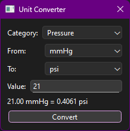

---

## Terminal Velocity Calculator

The Terminal Velocity Calculator estimates the terminal velocity and fall time of an object dropped from a given height, considering air resistance with customizable parameters.

### Inputs

- **Mass:** The mass of the object. Users can input the value and select units (`kg` or `lb`). Internally converted to kilograms.
- **Cross-sectional Area:** The effective area facing airflow. Users input the value and select units (`m²`, `cm²`, or `in²`). Internally converted to square meters.
- **Height:** The drop height. Input value with unit options (`m` or `ft`). Internally converted to meters.
- **Air Density or Altitude:**
  - User can choose to enter the air density directly (`kg/m³`),
  - or provide the altitude in meters to compute air density using a simplified barometric formula,
  - or enter a custom air density value.
- **Drag Coefficient:** Select from presets corresponding to common shapes:
  - Sphere (0.47),
  - Flat Plate (1.28),
  - Cylinder (1.2),
  - Streamlined Body (0.04),
  - or input a custom drag coefficient.

### Calculations

- **Terminal Velocity:** Calculated using the formula  
  \[
  v = \sqrt{\frac{2 m g}{\rho A C_d}}
  \]
  where \(m\) is mass, \(g\) is gravity, \(\rho\) is air density, \(A\) is cross-sectional area, and \(C_d\) is drag coefficient.
  
- **Fall Time with Drag:** Numerically estimated by integrating the equations of motion considering gravitational force and drag force, using a small time step for accuracy.

- **Fall Time without Drag:** Calculated by the standard formula \(t = \sqrt{\frac{2 h}{g}}\) for reference.

### Outputs

- Terminal velocity (m/s)
- Fall time with drag (s)
- Fall time without drag (s)
- A velocity vs. time plot illustrating how velocity approaches terminal velocity during the fall.

### Plot Export

- The velocity vs. time plot is automatically saved as a PNG image in the user’s results directory.
- The filename includes a timestamp, e.g., `terminal_velocity_20250520_153045.png`.
- The saved plot path is displayed alongside calculation results.
- The export process is integrated with the platform’s logging system to record the event.

### User Interface

- Input fields paired with unit selectors provide flexibility and reduce errors.
- Dropdown menus allow easy selection of air density mode and drag coefficient presets.
- The plot updates dynamically upon calculation.
- Clear error messages are shown for invalid inputs.

### Integration

- The calculator supports logging and session export as part of Science Hub’s unified environment.
- The saved plot can be referenced or used in reports, presentations, or further analysis.

---

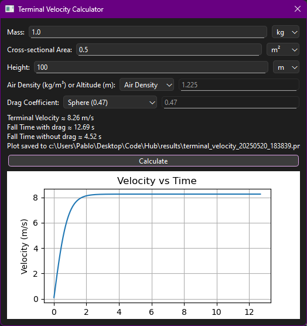

## Projectile Motion Tool

The Projectile Motion tool calculates the trajectory and key parameters of a projectile launched at an initial velocity and angle from a specified height.

### Features

- Input initial velocity with units (m/s, km/h, mph)  
- Input launch angle with units (degrees, radians)  
- Input initial height above ground with units (meters, feet)  
- Calculates:  
  - Range  
  - Maximum height  
  - Total flight time  
  - Time to maximum height  
  - Impact velocity magnitude and components  
- Plots the projectile trajectory (horizontal distance vs. height)  
- Includes an animation of the projectile motion on the plot  
- Automatically saves the trajectory plot as a PNG image in the results folder with a timestamped filename  
- Logs calculation details and export events for reproducibility  

### User Interface

The tool provides labeled input fields with unit selectors, a results display area, and an embedded matplotlib plot. Buttons allow calculation and animation control.

### Usage Notes

- Ensure inputs are valid numbers; units are automatically converted to SI for calculations.  
- The animation visualizes the projectile’s path based on the calculated trajectory points.  
- The exported plot file path is shown in the results area after calculation.

---
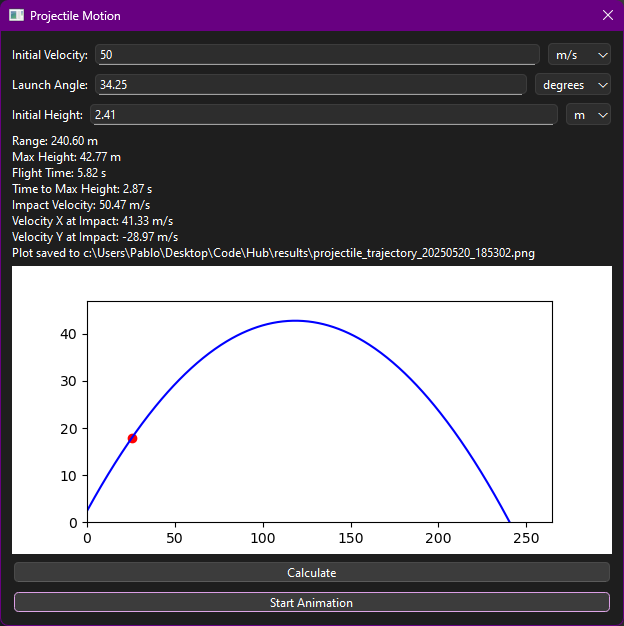

## Lens & Mirror Calculator

The Lens & Mirror Calculator solves the lens/mirror equation by requiring two of the three parameters: focal length (f), object distance (do), and image distance (di). It calculates the missing parameter and provides magnification and lens type information.

### Features

- Input focal length, object distance, and image distance, with units (meters, centimeters, millimeters, inches, feet)  
- Supports toggling between lens and mirror calculations with appropriate sign conventions  
- Calculates and displays magnification and indicates whether the optical element is converging or diverging  
- Validates input, requiring exactly two fields filled for calculation  
- Provides tooltips to guide user input  
- Includes a checkbox toggle for mirror mode that affects sign conventions  
- Displays a basic ray diagram showing object, image, focal points, and principal rays  
- Automatically exports the ray diagram plot as a timestamped PNG to the results directory and logs the export event  
- Clear/reset button to quickly reset inputs and outputs

### User Interface

Inputs are paired with unit selectors and tooltips. The mirror toggle checkbox is placed prominently above inputs to switch calculation mode. Results and ray diagram appear below inputs with action buttons for calculate and clear.

---

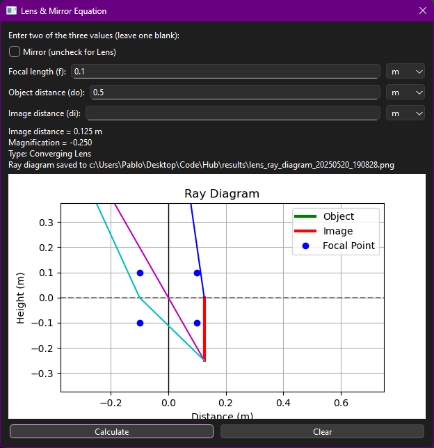

## Ohm's Law Calculator

The Ohm’s Law Calculator computes the missing electrical parameter when given any two of the three: voltage (V), current (I), and resistance (R).

### Features

- Inputs for voltage, current, and resistance with selectable units:
  - Voltage: V, mV, kV  
  - Current: A, mA, kA  
  - Resistance: Ω, mΩ, kΩ, MΩ  

- Automatic unit conversion: when changing a unit, the input number updates to reflect the same physical quantity in the new unit.

- Input validation allowing only decimal numbers (no scientific notation).

- Clear and Solve buttons for convenient user interaction.

- Displays result with proper formatting, maintaining physical correctness with units.

- Logs all calculations with inputs and results for reproducibility.

### User Interface

Each input field is paired with a unit selector dropdown. Tooltips explain each parameter. Results appear below inputs. The interface enforces that exactly two inputs are filled for calculation.

---

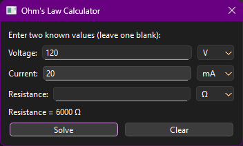

## Speed Calculator

The Speed Calculator computes the speed given a distance and time, supporting multiple units for inputs and outputs.

### Features

- Input distance with unit selection: meters (m), kilometers (km), miles (mile), feet (ft)  
- Input time with unit selection: seconds (s), minutes (min), hours (hr)  
- Output speed selectable in meters per second (m/s), kilometers per hour (km/h), or miles per hour (mph)  
- Input validation and error handling (e.g., time cannot be zero)  
- Displays the calculated speed formatted to three decimal places  
- Logs inputs and computed speed for reproducibility  

### User Interface

The interface provides labeled fields with dropdowns for units, a clear Calculate button, and a result display area.

---

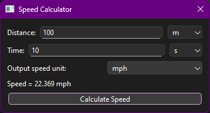

## Drag Force Calculator

Calculates the drag force \( F_d \) experienced by an object moving through a fluid using the formula:

\[
F_d = \frac{1}{2} \rho v^2 C_d A
\]

where:
- \( \rho \) is the air density,
- \( v \) is the velocity,
- \( C_d \) is the drag coefficient,
- \( A \) is the cross-sectional area.

### Features

- Inputs for air density, velocity, drag coefficient, and cross-sectional area  
- Unit selectors for air density (kg/m³, g/cm³), velocity (m/s, km/h, mph), and area (m², cm², ft²)  
- Automatic conversion of all inputs to SI units for calculation  
- Validates inputs and displays clear error messages  
- Displays drag force in Newtons (N) with three decimal places  
- Includes Clear button to reset inputs to defaults  
- Logs inputs and calculated drag force for reproducibility  

### User Interface

Inputs are organized in labeled rows with unit selectors. The result is shown below inputs, with action buttons for calculation and clearing.

---

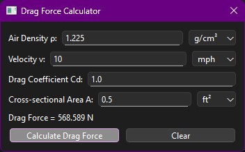

## Acceleration Calculator

Calculates acceleration given the change in velocity (Δv) over a time interval.

### Features

- Input change in velocity with unit options: meters per second (m/s), kilometers per hour (km/h), miles per hour (mph)  
- Input time with unit options: seconds (s), minutes (min), hours (hr)  
- Automatic conversion of all inputs to SI units (m/s and seconds) for calculation  
- Validates input and prevents division by zero  
- Displays acceleration in meters per second squared (m/s²) with three decimal places  
- Clear and Calculate buttons for user convenience  
- Logs all inputs and calculation results for reproducibility  

### User Interface

Labeled input fields paired with unit dropdown selectors. Results appear below inputs. Buttons for calculation and clearing are clearly arranged.

---

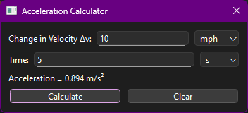

## Force Calculator

Calculates the force \( F = m \times a \) given mass and acceleration inputs.

### Features

- Inputs for mass and acceleration with unit selectors:
  - Mass: kilograms (kg), grams (g), pounds (lb)  
  - Acceleration: meters per second squared (m/s²), feet per second squared (ft/s²)  
- Automatic conversion between units to SI base units for calculation  
- Input validation allowing decimal numbers only  
- Clear and Calculate buttons  
- Displays calculated force in Newtons (N) with three decimal places  
- Logs all inputs and results  
- Interactive matplotlib graph showing Force vs. Acceleration for a range around the current input, highlighting the current value

### User Interface

Each input is paired with a unit dropdown. Results display below inputs. Buttons for calculation and clearing are provided. The graph updates dynamically after each calculation.

---

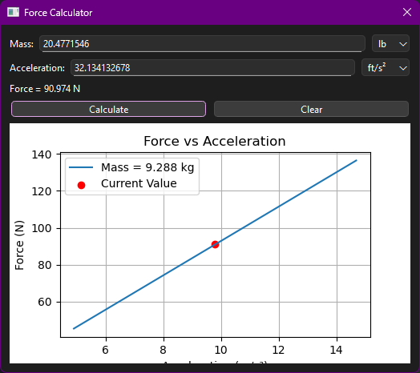

## Kinetic Energy Calculator

Calculates kinetic energy using the formula:

\[
KE = \frac{1}{2} m v^2
\]

where \( m \) is mass and \( v \) is velocity.

### Features

- Inputs for mass and velocity with unit selectors:
  - Mass units: kilograms (kg), grams (g), pounds (lb)  
  - Velocity units: meters per second (m/s), kilometers per hour (km/h), miles per hour (mph)  
- Automatic unit conversions to SI units for calculation  
- Input validation allowing decimal numbers only  
- Clear and Calculate buttons  
- Displays kinetic energy in joules (J) formatted to three decimals  
- Logs inputs and results for reproducibility  
- Interactive matplotlib plot showing kinetic energy vs velocity for a fixed mass, highlighting the current input value  

### User Interface

Input fields are paired with dropdown selectors for units. The result is displayed below inputs. Buttons for calculation and clearing are provided. The plot dynamically updates after each calculation.

---

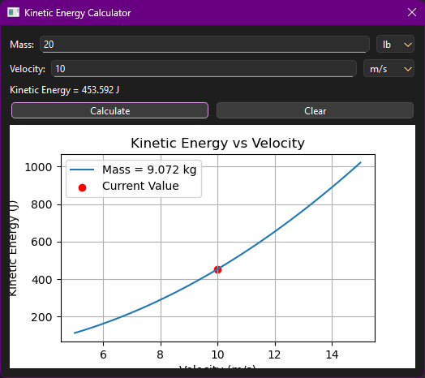

## Molecular Weight Calculator

Calculates the molecular weight of a compound given its chemical formula.

### Features

- Accepts molecular formulas with:
  - Nested parentheses for grouping (e.g. `(NH4)2SO4`)  
  - Hydrate notation using `·` or `.` (e.g. `CuSO4·5H2O`)  
- Parses and counts atoms accurately, including multipliers  
- Uses comprehensive element data from the periodic table JSON  
- Displays a detailed breakdown of each element’s count, atomic mass, and subtotal contribution  
- Lists unknown elements if input symbols do not match the database  
- Shows the total molecular weight in grams per mole (g/mol)  
- Provides Clear and Calculate buttons for easy interaction  
- Logs every calculation with formula and result for traceability

### User Interface

Input field for molecular formula with example placeholder. Result box shows formatted breakdown and total. Buttons below for calculate and clear actions.

---

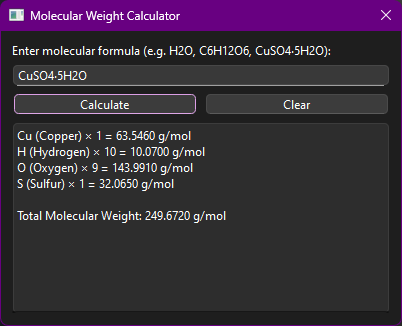

## Isotopic Notation Tool

Calculates and displays isotopic notation details for a given element symbol and mass number.

### Features

- Input for element symbol (e.g., H, He, Fe) with validation and auto-capitalization  
- Input for mass number (integer only) with validation  
- Displays isotopic notation including:
  - Proton count (atomic number)  
  - Neutron count  
  - Atomic mass (from isotope data if available)  
  - Natural abundance percentage (if known)  
  - Element name and symbol  

- Visual nucleon composition pie chart (protons vs. neutrons) rendered via matplotlib  
- Automatic saving of the isotope composition chart image with timestamp in a `results` folder  
- Saved image path displayed alongside calculation results  
- Export chart image manually via file dialog  
- Copy result text to clipboard button  
- Clear error messages and input validation feedback  
- Logs all input and output events for traceability  

### User Interface

Clean layout with labeled inputs, action buttons (Calculate, Copy Result, Export Chart), a rich-text result display, and an embedded matplotlib chart canvas.

---

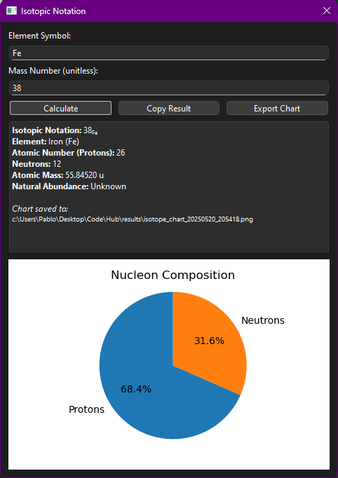

## Shell Visualizer

Visualizes the electron shell structure of elements using data from the periodic table database.

### Features

- Input field for element symbol (e.g., H, He, Fe) with placeholder and auto-capitalization  
- Electron shells drawn as concentric colored circles with electrons positioned evenly on each shell  
- Dynamic radius scaling using square root spacing to handle large atoms gracefully  
- Automatic scaling and clamping of shell radii to fit within the visualization window  
- Embedded matplotlib canvas with interactive navigation toolbar for zooming, panning, and saving  
- Visualization saved automatically as a timestamped PNG file in the `results` folder  
- Status label shows saved image path instead of popup messages  
- Responsive PyQt6 layout with expanding canvas for better viewing experience  
- Logs all actions and saved image paths for traceability

### User Interface

Clean and simple interface with labeled input, a “Draw & Save” button, a status label, and the embedded interactive plot with navigation toolbar.

---

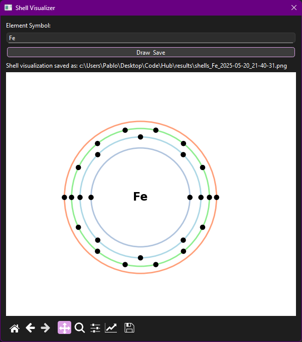

## Phase Predictor

Predicts the phase (solid, liquid, gas) of an element at a given temperature and pressure based on melting and boiling points.

### Features

- Input element symbol with auto-capitalization and validation  
- Temperature input accepts °C, °F, or K with optional unit suffix (e.g., 25, 77F, 300K)  
- Optional pressure input in atmospheres (atm), defaulting to 1 atm  
- Uses melting and boiling point data from periodic table database (in Kelvin)  
- Color-coded predicted phase display for easy interpretation  
- Rich text output with melting/boiling points and phase prediction  
- Robust input validation with clear error messages  
- Logs all inputs and predictions for traceability  
- Simple, clean PyQt6 interface with helpful placeholders and labels

### Usage

Enter an element symbol and temperature with optional unit suffix, optionally specify pressure, then click “Check Phase” to see the predicted phase.

---

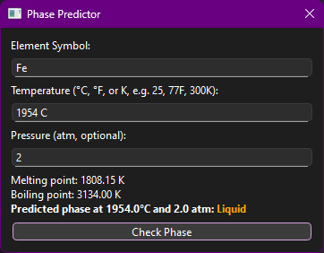

## Element Comparator

Compare multiple elements side-by-side across various physical, chemical, and atomic properties.

### Features

- Select 3 elements by default (expandable) with searchable combo boxes  
- Properties grouped into categories with tabs: Atomic, Chemical, Physical  
- Select properties via checkboxes with “Select All” and “Select None” buttons per category  
- Filter properties by text input for quick searching  
- Displays a sortable table comparing selected elements’ properties side-by-side  
- Automatic units and formatted numeric values  
- Highlights max values in blue bold font and min values in red italic font for numeric properties  
- Italicizes categorical differences for easy visual spotting  
- Tooltips on property names provide scientific descriptions  
- Export comparison table to CSV file  
- Copy table contents to clipboard for easy pasting  
- Robust input validation and error handling  
- Logs user actions and comparison summaries

### User Interface

Simple, clean UI with tabs for property categories, multiple element selectors, and a feature-rich comparison table.

---

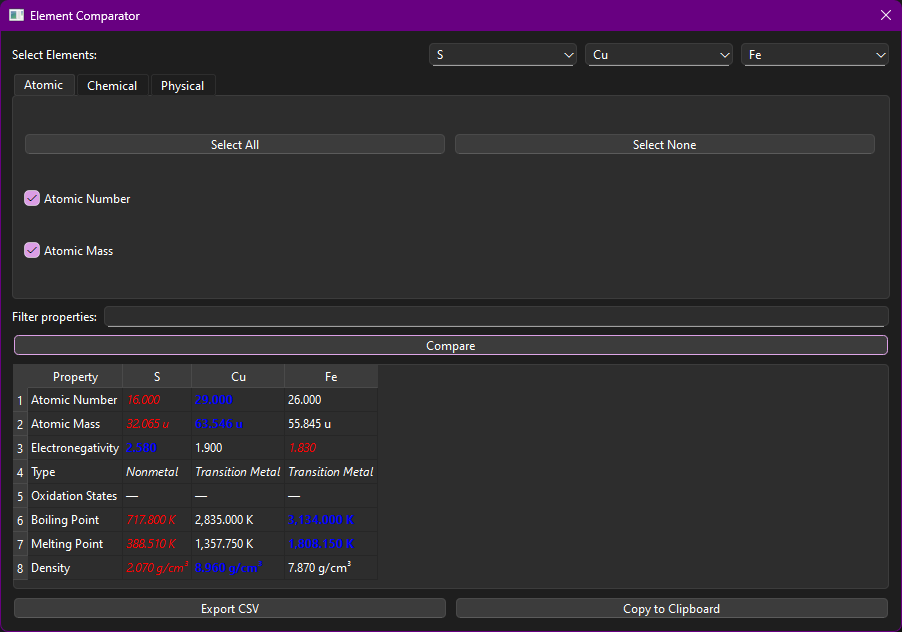

## Reaction Balancer

Balances chemical equations by calculating stoichiometric coefficients for reactants and products.

### Features

- Input one or more unbalanced chemical reactions (one per line)  
- Supports reaction arrows `->` or `=` and separates species by `+`  
- Parses chemical formulas with nested parentheses and element counts  
- Uses linear algebra (`sympy`) to find integer coefficients balancing the reaction  
- Outputs balanced chemical equations with correct coefficients  
- Shows error messages for invalid input or unsolvable reactions  
- Copy balanced equations easily from the result list  
- Logs all inputs and results for traceability

### Usage

Enter unbalanced reaction(s) in the input box, one per line, then click "Balance All". Select any balanced reaction and click "Copy Selected" to copy it to clipboard.

---

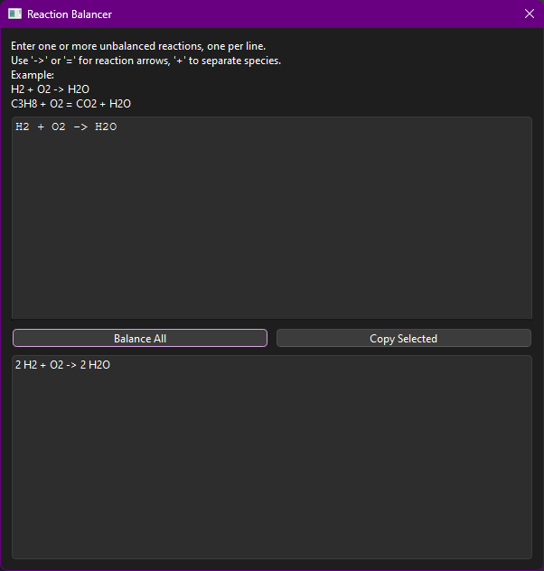

## Element Property Grapher

The Element Property Grapher visualizes various numeric properties of chemical elements plotted against atomic number using an interactive scatter plot.

### Features

- Loads element data from the periodic table JSON file and user settings from configurable paths.
- Reads favorite elements from a JSON file and highlights them distinctly.
- Select from all available numeric properties with an editable, searchable dropdown.
- Filter the property list dynamically via text input.
- Plot points colored by element category, with favorites shown in gold.
- Toggle logarithmic scaling for X (atomic number) and Y (property) axes.
- Show or hide element symbol labels on the plot.
- Interactive hover tooltips displaying element name, symbol, atomic number, and property value.
- Save plots automatically as timestamped PNG files in the results directory.
- Export displayed data as CSV files via a save dialog.
- PyQt interface featuring buttons for Plot, Save Plot, and Export CSV.
- Embedded matplotlib canvas with navigation toolbar.
- Comprehensive event logging for plotting, saving, and exporting actions.

### User Interface

- Editable combo box for property selection.
- Text box to filter property dropdown dynamically.
- Checkboxes for logarithmic scale toggling and label visibility.
- Buttons to plot the data, save the current plot image, and export data to CSV.
- Interactive matplotlib plot embedded in the window with hover annotations.

---

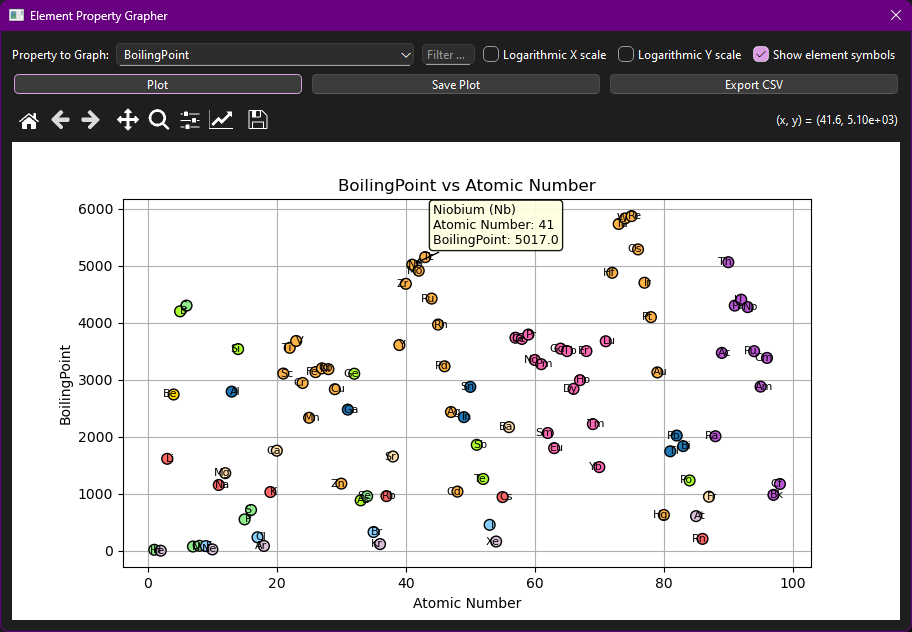

---

## DNA Transcription & Translation Tool

A tool to transcribe a DNA sequence into mRNA and translate it into a protein sequence with visualization of codon usage.

### Features

- Validates input DNA sequences to contain only A, T, C, G characters.
- Auto-capitalizes and cleans input sequences.
- Transcribes DNA to mRNA (T → U).
- Translates mRNA codons to protein sequences using a codon table.
- Displays transcription and translation results clearly in the UI.
- Visualizes codon usage frequency in a horizontal bar chart embedded in the interface.
- Automatically saves codon frequency plots with timestamped filenames in the results directory.
- Displays saved chart image path in the output area after autosave.
- Allows manual export of the codon frequency chart via file dialog.
- Copy transcription and translation results to clipboard with a button.
- Error handling with messages displayed in the output area.
- Logs all significant user actions for traceability.
- Clean, accessible UI layout with buttons for Translate, Copy Result, and Export Chart.

### User Interface

- Input field for DNA sequence with placeholder and input validation.
- Output text area showing mRNA and protein sequences.
- Embedded matplotlib chart displaying codon frequency.
- Buttons for translating, copying results, and exporting the chart.
- Informative status messages including saved image paths.

---

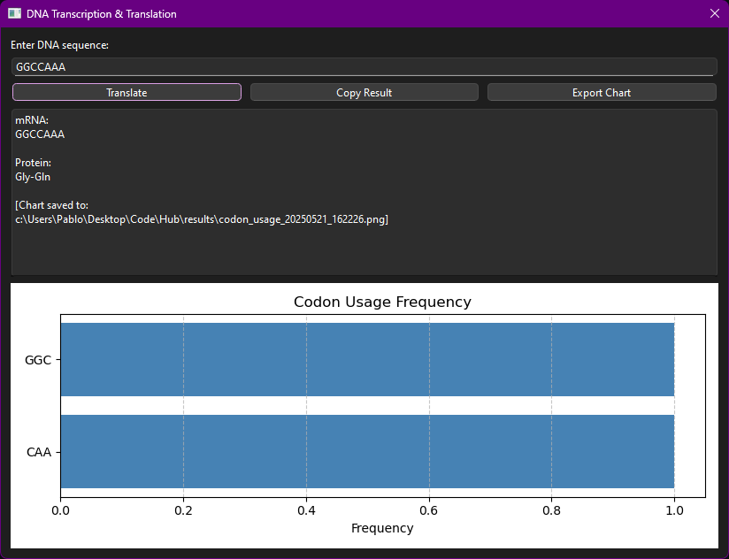